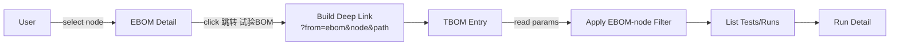
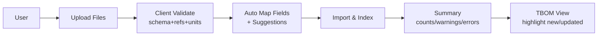
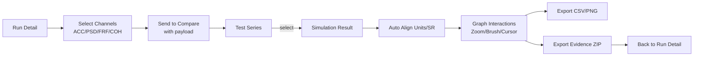

# 产品过程数据中心（试验BOM增强） UI/UX Specification

> 文档目的：定义项目的用户体验目标、信息架构、关键用户流程与视觉/交互规范，为前端实现提供可执行、可验收的依据。
> 信息来源：docs/brief.md（2025-10-14）、docs/prd.md（评审基线 v0.2 冻结，2025-10-15）、现有前端代码（Next.js 15 App Router，Tailwind，组件目录）
> 版本：评审基线 v0.2（冻结）｜日期：2025-10-15

---

## 1. Introduction
本规范面向“产品过程数据中心（试验领域）”，用于指导试验BOM（TBOM）相关功能的前端设计与实现，确保体验一致、可达可用、性能可控，并与现有 XBOM 模块保持一致的交互与视觉语言。

- 作用范围：TBOM 结构/详情/导入向导/Compare 扩展/证据导出；与 EBOM 的挂接导航与深链。
- 与代码契合点：
  - App Router（`app/`）与模块编排（`components/`）现状不变，新增 TBOM 相关视图建议放置于 `components/tbom/`。
  - 复用现有公共组件与查看器（`components/common/*`、PDF/图片/3D 等）。
  - Tailwind 样式与 a11y 约定沿用仓库规范。

### 1.1 Overall UX Goals & Principles（草案）

- Target User Personas（候选）
  - 型号总师/项目经理：基于证据链快速裁决与评审。
  - 系统工程/需求管理：维护需求→用例→试验结果链路，跟踪缺口闭环。
  - 试验工程师：组织试验项目与运行，导入/核对结果与事件。
  - 仿真工程师：与试验结果对齐口径，进行曲线/PSD/FRF 对比。
  - 设计工程师：查看结构节点上的相关试验与影响评估。
  - 质量/可靠性工程师：关注故障/异常事件与报告。
  - 管理员/配置管理：口径与基线治理、权限与审计。

- Usability Goals
  - 发现能力：从 EBOM 节点到“相关试验”的跳转≤2步；TBOM 内搜索/筛选命中率≥90%。
  - 完成效率：导入最小数据包（CSV/JSON）全流程≤3分钟；对比与导出≤1分钟。
  - 口径一致：ACC/PSD/FRF/COH 单位/采样率可见且一键对齐；异常清晰标注。
  - 可达可用：主要交互可键盘完成；空/错/大文件场景有明确引导与降级。

- Design Principles（建议）
  1. Clarity over cleverness（清晰优先）
  2. Progressive disclosure（循序显露）
  3. Consistent patterns（模式一致）
  4. Immediate feedback（即时反馈）
  5. Accessible by default（默认可访问）
  6. Evidence-first（证据优先，可追溯链路显式）
  7. Performance-aware（面向大数据的性能友好）

- Rationale（为何如此）
  - 来自 PRD 的“证据链与对比”是核心价值，故强调发现/对比/导出路径的最少步数与显式口径。
  - 现有代码已实现多个查看器和对比能力，提倡复用与一致性，避免新增模式造成学习成本。
  - 面对时序/频域大数据，交互与动画必须以性能优先，减少重绘/重算。

### 1.2 Change Log
| Date | Version | Description | Author |
|---|---|---|---|
| 2025-10-15 | v0.1-draft | 初始化引言与 UX 目标/原则（结合现有代码与 PRD v0.2） | UX Expert |
| 2025-10-15 | v0.2-draft | 增补 IA 2.2/2.3、User Flows 3.1–3.3、视觉/可达性/响应式/动效/性能/下一步 | UX Expert |
| 2025-10-15 | v0.2（冻结） | 冻结评审基线：1–9 章成稿；与 PRD v0.2/NFR 对齐；不含代码改动 | UX Expert |

---

## 2. Information Architecture (IA)

### 2.1 Site Map / Screen Inventory（Mermaid）

```mermaid
graph TD
  A[App Root] --> B[Dashboard]
  A --> C[Data Explorer]
  A --> D[Product Structure (XBOM)]
  A --> E[Compare Center]
  A --> F[Upload Manager]
  A --> G[Completion]
  A --> H[Relation Graph]
  A --> I[Settings]

  D --> D1[EBOM Tree + Detail Panel]
  D --> D2[Simulation Explorer]
  D --> D3[Validation Matrix / Reviews]

  D1 --> D1a[Node Detail: KPIs • Docs • Params • 3D • Links]
  D1 --> D1b[Jump: TestBOM (reserved)]

  E --> E1[Scheme Compare]
  E --> E2[Condition Compare]
  E --> E3[Test vs Simulation]
  E --> E4[Design vs Requirement]
  E --> E5[EBOM Baseline Diff]

  D1b -.-> T[TBOM (Planned)]
  T --> T1[Structure: Type→Project→Test→Run]
  T --> T2[Run Detail: Records/Results/Events]
  T --> T3[Import Wizard]
  T --> T4[Evidence Export]
```

### 2.2 Navigation Structure

- Primary Navigation（侧边栏）
  - Dashboard｜Data Explorer｜Product Structure (XBOM)｜Compare｜Upload｜Completion｜Relation Graph｜Settings

- Secondary Navigation（模块内）
  - Product Structure（XBOM）
    - 左：树（EBOM/仿真入口）｜右：详情面板（基础信息、KPI、多视图、文档清单、知识轨、时间线、评审、影响分析、迷你树对比等）
    - 节点详情内预留“跳转 试验BOM”按钮（过渡方案），用于承载 TBOM 深链参数
  - Compare Center
    - Compare Modes：方案｜工况｜试验/仿真｜设计/需求｜EBOM 基线
    - Data Types：参数｜曲线｜模型｜图片｜文档
  - Settings：项目/口径/阈值等配置（只读为主）

### 2.3 Rationale（权衡与假设）

- 侧边栏主导航 + 模块内二级导航与现有代码一致，降低学习成本。
- TBOM 暂标注为 Planned，通过 XBOM 已预留入口承载深链参数，便于渐进式上线与回滚。
- Compare 模式与数据类型沿用现状，后续仅在模式层扩展“试验维度”，减少 UI 变化范围。
- 待确认：XBOM 详情面板默认展开策略（KPI/文档/知识/时间线/评审等）。

---

## 3. User Flows

### 3.1 从 XBOM 节点跳转到 TBOM（深链过滤）
用户目标：从 EBOM 树节点出发，在 TBOM 中自动按结构节点过滤，查看挂接试验及运行。

对接点：`components/structure/ebom/EbomDetailPanel.tsx`（“跳转 试验BOM”）；`components/structure/ProductStructure.tsx`；`components/compare/CompareCenter.tsx`。

主要步骤：
1. 在 XBOM 左侧树选择节点，右侧详情展示节点信息与操作。
2. 点击“跳转 试验BOM”。
3. 构造深链参数：`?from=ebom&node=<ebom_node_id>&path=<ebom_path>`。
4. 进入 TBOM，读取参数并启用“按结构节点过滤”，聚焦相关 Test/TestRun。
5. 用户继续筛选（类型/时间/状态），进入运行详情。

分支/边界：无挂接试验（空态引导）；参数不完整（回退默认视图并提示）；权限受限（仅计数/受限标签）。

可达性：按钮可键盘激活；进入 TBOM 后焦点置于过滤条并朗读条件。



---

### 3.2 最小上载导入向导（CSV/JSON → TBOM）
用户目标：通过最小契约数据包快速导入，立即在 TBOM 结构与运行详情可见。

对接点：TBOM 模块顶部工具区（规范先行）；复用 `components/common/*`、导出工具参考 `components/structure/ebom/exportUtils.ts`。

主要步骤：
1. 点击“导入数据包” → 选择类型（JSON/CSV/ZIP）。
2. 客户端校验（schema/ID 参照/单位采样率口径）。
3. 映射确认（自动映射为主；异常字段高亮并建议修正）。
4. 提交导入 → 展示结果摘要（计数/警告/错误/忽略项），支持错误行/日志下载。
5. 跳转 TBOM 结构视图并高亮新增/更新的 Project/Test/Run。

策略选项：增量 vs 覆盖；严格 vs 容错。

边界/空错态：不支持列头/格式 → 明确列出并提供示例下载；大文件分块解析与进度条；本地持久化导入日志。

可达性：文件选择键盘可达；进度/摘要使用 ARIA live；错误逐行可聚焦。



---

### 3.3 运行详情 → Compare（试验/仿真） → 证据导出
用户目标：在单次运行详情页查看记录/曲线/事件；一键进入 Compare 的“试验/仿真”模式进行 ACC/PSD/FRF/COH 对比；导出证据包（zip）。

对接点：Compare 模式 `components/compare/CompareCenter.tsx`；导出工具 `components/structure/ebom/exportUtils.ts`；查看器 `components/common/*`。

主要步骤：
1. 在 TBOM 运行详情中勾选对比通道（`ACC_*` / `PSD_*` / `FRF_*` / `COH_*`）。
2. 点击“送入 Compare（试验/仿真）”，构造 compare payload（`run_id`、通道与单位/采样率元数据）。
3. Compare 载入试验通道；用户选择一个仿真结果（`simulation_result_id`），系统自动对齐单位/采样率（必要时提示转换/重采样）。
4. 进行图表交互分析（缩放/区间/光标对齐/读数），可导出 CSV/PNG。
5. 返回运行详情或导出“证据包（zip）”：结构清单（JSON）、选定图表 PNG、区间统计 JSON、事件 CSV、附件索引。

分支/边界：无仿真结果（提供“仅试验对比”模式）；单位/采样率不一致（对齐提示/自动统一/跳过并标注）；大数据（默认≤4 通道，按需加载与抽稀）。

可达性：关键按钮具键盘等效；对齐/导出提示使用 `aria-live`；错误提示可聚焦并附帮助链接。



---

## 4. Visual Design System

### 4.1 Color Palette（Tailwind Tokens）

| Color Type | Hex/Token | Usage |
|---|---|---|
| Primary | blue-600 / indigo-600（渐变 from-blue-600 to-indigo-600；浅色：blue-50/indigo-50） | 主要操作、品牌强调、头部徽标背景、活跃选项 |
| Secondary | slate-600 / gray-700（浅：gray-100/200） | 次要文本、分隔、非主操作按钮边框/悬停 |
| Accent | emerald-500 / amber-500 / rose-500 | 状态点缀（成功/警告/风险）、徽标计数、标签 |
| Success | emerald-600（bg-emerald-50） | 成功反馈、完成状态 |
| Warning | amber-600（bg-amber-50） | 风险提示、需关注项 |
| Error | rose-600（bg-rose-50） | 错误/破坏性操作 |
| Neutral | slate-50/100、gray-100/200/400/600/900 | 背景、文本分层、描边 |

说明：沿用现有代码中的 Tailwind 色阶；渐变头部/侧边栏选中已广泛使用 blue→indigo；状态色采用 emerald/amber/rose，保持与现有徽标/标签一致。

### 4.2 Typography

- Font Families：
  - Primary：系统字体栈（San Francisco / Segoe UI / Roboto / Noto Sans / PingFang / Microsoft YaHei，按系统回退）
  - Secondary：等同 Primary（不另设品牌字体，降低包体与渲染抖动）
  - Monospace：Menlo/Consolas/Monaco（用于代码/日志片段）

- Type Scale（建议，与 Tailwind 文档尺度对应）：

| Element | Size | Weight | Line Height |
|---|---|---|---|
| H1 | 24–30px（text-2xl/3xl） | 600–700 | 1.25–1.3 |
| H2 | 20–24px（text-xl/2xl） | 600 | 1.3 |
| H3 | 16–18px（text-base/lg） | 600 | 1.35 |
| Body | 14–16px（text-sm/base） | 400–500 | 1.5 |
| Small | 12–13px（text-xs） | 400–500 | 1.4 |

### 4.3 Iconography

- Icon Library：Remix Icon（`ri-` 前缀，现有代码已统一使用）。
- Usage Guidelines：
  - 文案前置图标尺寸 14–16px；按钮 16–20px；空态 32–48px。
  - 与状态色绑定：成功（emerald）、警告（amber）、错误（rose）、信息（blue/indigo）。
  - 保持对齐与触达区域：触达目标至少 32×32px。

### 4.4 Spacing & Layout

- Grid System：12 列网格（Desktop）；关键面板采用 3 区布局（导航/内容/右侧栏）。
- Spacing Scale（Tailwind 间距建议）：2/4/6/8/12/16/24/32px（`gap-0.5/1/1.5/2/3/4/6/8`）。
- 分区规范：
  - 列表/树：左右留白 ≥ 16px；行高 ≥ 36px；批量操作区固定。
  - 详情面板：分组标题与内容间距 12–16px；卡片内边距 16–24px；卡片组间距 16px。

---

## 5. Accessibility Requirements

### 5.1 Compliance Target
- Standard：WCAG 2.1 AA（对比度、键盘导航、焦点可见、结构可朗读）。

### 5.2 Key Requirements
- Visual
  - 对比度：正文文本与背景≥4.5:1；大文本≥3:1；渐变背景上的文字加半透明遮罩或描边。
  - 焦点：所有交互元素需可见焦点环（建议 `ring-2 ring-offset-2 ring-blue-500`）。
  - 文本：允许 200% 缩放不破版；长文本断词/省略策略一致。
- Interaction
  - 键盘：侧栏导航、树/列表、导入向导、Compare、导出均可完全用键盘操作；提供“跳到主内容”的跳过链接。
  - 屏幕阅读器：关键区域提供 `aria-label`/`aria-live`；表格列头/单元格关联；按钮/开关的状态朗读一致。
  - 触控目标：命中区≥32×32px。
- Content
  - Alt 文本：图片/关键图标提供替代文本（装饰性图标 `aria-hidden`）。
  - Heading 结构：每页仅一个 h1；分区层级清晰；面包屑使用 `nav[aria-label='breadcrumb']`。
  - 表单标签：显式 `<label for>` 关联；错误提示与字段关联且可聚焦。

### 5.3 Accessibility Testing Strategy
- 静态扫描：eslint-plugin-jsx-a11y、axe DevTools 快照。
- 手动走查：键盘路径（Tab/Shift+Tab/Enter/Escape）、缩放到 200%、高对比度模式。
- 辅助技术：NVDA/VoiceOver 关键路径抽检（导航、导入、Compare、导出）。

---

## 6. Responsiveness Strategy

### 6.1 Breakpoints（Tailwind）
| Breakpoint | Min Width | Max Width | Target Devices |
|---|---|---|---|
| Mobile | 0px | 639px | Phones |
| Tablet | 640px | 1023px | Small tablets/landscape phones |
| Desktop | 1024px | 1535px | Laptops/standard desktops |
| Wide | 1536px | — | Large/hi‑res monitors |

说明：仓库规范强调 `sm`/`md`/`lg`（≥1280px 保证布局），在 `lg` 以上增加边距与密度优化。

### 6.2 Adaptation Patterns
- Layout Changes：
  - Mobile：顶部/抽屉式导航，树/详情切换视图；工具条折叠为菜单。
  - Tablet：左右栅格改为上下折叠，详情面板切为单列卡片。
  - Desktop/Wide：三栏布局（导航/内容/右栏）；Compare 图表区域随容器自适应。
- Navigation Changes：
  - 侧栏在 `sm` 收起为图标栏，`md` 显示短标签，`lg` 展开完整标签。
  - 面包屑在移动端缩短为 1–2 级，提供“更多”折叠。
- Content Priority：首屏优先内容（结构/筛选/关键指标），次要信息折叠。
- Interaction Changes：触控命中区增大；Hover 交互提供点击等效。

---

## 7. Animation & Micro-interactions

### 7.1 Motion Principles
- 意图可辨：仅用于表达层级、状态变化与反馈，避免装饰性动画。
- 快速克制：进入/退出 120–200ms；过渡 150–250ms；采用 standard/decelerate 曲线。
- 可关闭/降级：用户启用 `prefers-reduced-motion` 时禁用大幅动画，仅保留淡入淡出。
- 性能优先：避免长列表/大型图表区域的高频动画；不阻塞主线程。

### 7.2 Key Animations（建议）
- 导入向导步进：Fade + TranslateY 12px（160ms，ease-out）。
- Compare 视图缩放：图表区域淡入与轴线过渡（180ms，ease-in-out）。
- 徽标计数更新：Scale 95%→100% + Fade（120ms，ease-out）。
- Toast/反馈：右下角 SlideIn（200ms，ease-out），3–5s 自动消退。
- 抽屉/侧栏：SlideX 24px（180ms）+ 遮罩渐入（120ms）。

---

## 8. Performance Considerations

### 8.1 Performance Goals（对齐 PRD v0.2/NFR）
- Page Load：首屏可交互 TTI < 2.0s；路由切换 P95 < 2.5s。
- Interaction Response：大曲线交互（≤10万点×4 通道）P95 < 120ms。
- Animation FPS：首选 60fps；大数据图表不低于稳定 30fps。

### 8.2 Design Strategies
- 图表/时序：分块加载 + 视口抽稀（decimation）+ Web Worker；缩放不触发整表重算。
- 列表与树：虚拟滚动（仅渲染可见行）；骨架屏/渐进加载。
- 资源：动态导入重组件；合并小资源；新增依赖需在 PR 说明包体影响与替代方案。
- 导出：ZIP 分块打包；图表导出采用离屏渲染；避免主线程长阻塞。
- 回退：弱网/低配下自动降级动画与实时性，保持可用性。

### 8.3 Measurement & Tooling
- 构建体积：`next build` 输出对比，记录关键路由包体与第三方依赖变化。
- Web Vitals：LCP/INP/CLS 走查；Lighthouse 快照；核心交互录制。
- 自定义埋点：导入/对比/导出耗时与失败率，本地日志留存以便走查。

---

## 9. Next Steps

### 9.1 Immediate Actions
1. 评审本规范第 1–8 章并定版（v0.1 → v0.2）。
2. 依据“3. 用户流程”产出低保真线框（XBOM→TBOM、导入向导、运行详情、Compare 对接、证据导出）。
3. 对齐 `docs/tbom-contract.md` v1.0 字段/校验规则；扩充 mocks（多类型/多运行/异常事件）。
4. 形成组件清单与复用矩阵（复用 `components/common/*` 与现有查看器），确认不新增设计模式。
5. 制定 a11y 与性能走查脚本（键盘路径/缩放/弱网/大数据）。

### 9.2 Design Handoff Checklist
- [ ] 所有关键用户流程已文档化并配线框/状态图。
- [ ] 组件/样式变量（色板/排版/间距）清单完整。
- [ ] 可访问性要求（第 5 章）落实到组件规范。
- [ ] 响应式策略（第 6 章）落到布局与断点说明。
- [ ] 性能目标与策略（第 8 章）映射到实现任务与验收。

附注：评审走查清单见 `docs/ui-architecture.md` 的“附录 A · 评审走查清单（前端 · Mock）”。

### 2.2 Navigation Structure

- Primary Navigation（侧边栏）
  - Dashboard｜Data Explorer｜Product Structure (XBOM)｜Compare｜Upload｜Completion｜Relation Graph｜Settings

- Secondary Navigation（模块内）
  - Product Structure（XBOM）
    - 左：树（EBOM/仿真入口）｜右：详情面板（基础信息、KPI、多视图、文档清单、知识轨、时间线、评审、影响分析、迷你树对比等）
    - 节点详情内预留“跳转 试验BOM”按钮（过渡方案），用于承载 TBOM 深链参数
  - Compare Center
    - Compare Modes：方案｜工况｜试验/仿真｜设计/需求｜EBOM 基线
    - Data Types：参数｜曲线｜模型｜图片｜文档
  - Settings：项目/口径/阈值等配置（只读为主）

- Breadcrumb Strategy
  - XBOM：在 EBOM 详情区域显示“树路径”作为面包屑（示例：根/子系统/组件）
  - TBOM（规划中）：`EBOM 节点路径 → TBOM` 作为反向导航的面包屑

### 2.3 Rationale（权衡与假设）

- 选择保持“侧边栏主导航 + 模块内二级导航”的结构，与现有代码一致，避免引入新的导航范式；可降低学习成本。
- 将 TBOM 标注为“Planned”，并通过 XBOM 的已预留入口承载深链参数，保证渐进式上线、可回滚。
- Compare 的模式与数据类型沿用现状，后续增加“试验维度”仅在模式层扩展，减少 UI 变更范围。
- TODO（需评审确认）：XBOM 详情面板的分区与标签是否需要精简（KPI/文档/知识/时间线/评审等项的默认展开策略）。

---

## 3. User Flows

### 3.1 从 XBOM 节点跳转到 TBOM（深链过滤）
**用户目标**：从 EBOM 树节点出发，在 TBOM 中自动按结构节点过滤，查看挂接试验及运行。

**相关代码位置（参考）**：
- 入口按钮（过渡方案已预留）：`components/structure/ebom/EbomDetailPanel.tsx` 附近“跳转 试验BOM”
- XBOM 模块外层：`components/structure/ProductStructure.tsx`
- Compare 模式清单：`components/compare/CompareCenter.tsx`

**主要步骤（标准路径）**：
1. 在 XBOM 左侧树选择节点，右侧详情展示节点信息与操作。
2. 点击“跳转 试验BOM”。
3. 构造深链参数：`?from=ebom&node=<ebom_node_id>&path=<ebom_path>`。
4. 进入 TBOM，读取参数并启用“按结构节点过滤”，聚焦相关 Test/TestRun。
5. 用户继续筛选（类型/时间/状态），进入运行详情。

**分支/边界**：无挂接试验（空态引导）；参数不完整（回退默认视图并提示）；权限受限（仅计数/受限标签）。

**可达性**：按钮可键盘激活；进入 TBOM 后焦点置于过滤条并朗读条件。


---

### 3.2 最小上载导入向导（CSV/JSON → TBOM）
**用户目标**：通过最小契约数据包快速导入，立即在 TBOM 结构与运行详情可见。

**对接点**：
- 导入入口：TBOM 模块顶部工具区（规范先行）。
- 复用组件：PDF/Image 预览（`components/common/*`）、导出工具（参考 `components/structure/ebom/exportUtils.ts`）。

**主要步骤**：
1. 点击“导入数据包” → 选择类型（JSON/CSV/ZIP）。
2. 客户端校验（schema/ID 参照/单位采样率口径）。
3. 映射确认（自动映射为主；异常字段高亮并建议修正）。
4. 提交导入 → 展示结果摘要（计数/警告/错误/忽略项），支持错误行/日志下载。
5. 跳转 TBOM 结构视图并高亮新增/更新的 Project/Test/Run。

**策略选项**：增量 vs 覆盖；严格 vs 容错。

**边界/空错态**：不支持列头/格式 → 明确列出并提供示例下载；大文件分块解析与进度条；本地持久化导入日志。

**可达性**：文件选择键盘可达；进度/摘要使用 ARIA live；错误逐行可聚焦。


